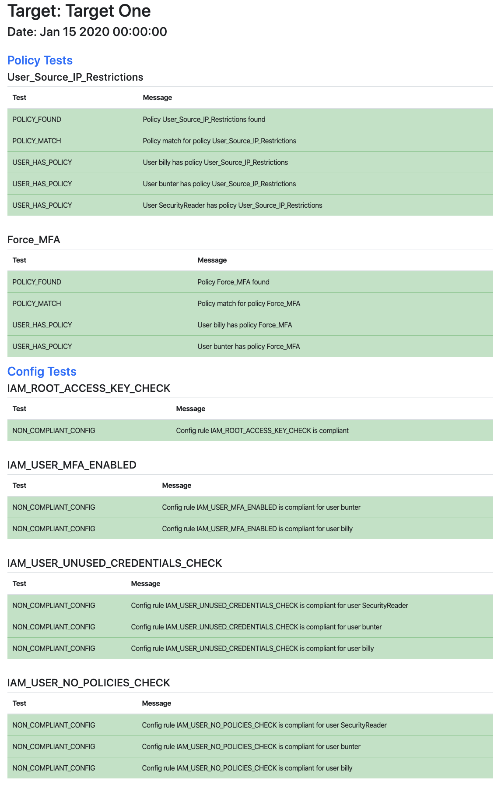

# CloudKestrel

A project to audit the security of AWS accounts.

## Expected AWS Setup

CloudKestrel expects DevOps users to be in one IAM group and the CloudKestrel user to be in a different IAM group.
CloudKestrel references several policies to maintain good AWS security.  The custom policies can be found in the Policies directory.

- Force_MFA - A custom policy to enforce MFA for a user.
- User_Source_IP_Restrictions - A custom policy to force CLI access from specific source IPs.
- SecurityAudit - An AWS policy to give the CloudKestrel user read access to the account.
- Config_Write - A custom policy to give the CloudKestrel user the right to create missing AWS Config rules.

The group policy setup should be as follows.

| Group         | Purpose                            | Attached Policies                                        |
| ------------- | -----------------------------------| -------------------------------------------------------- |
| DevOps        | DevOps users                       | Force_MFA, User_Source_IP_Restrictions                   |
| SecurityAudit | CloudKestrel and other audit users | User_Source_IP_Restrictions, SecurityAudit, Config_Write |

## Targets

CloudKestrel can audit more than one AWS account at a time.  AWS accounts you wish to audit are defined in the targets.json file.  
The Credentials element in the targets.json file details the environmental variable names which store the AWS Access and Secret Access Keys.
These environment variables should be available to the running script. 

```json
{
  "Targets": [{
      "target1": {
        "Credentials": {
          "AwsAccessKeyId": "TARGET1_AWS_ACCESS_KEY_ID",
          "AwsSecretAccessKey": "TARGET1_AWS_SECRET_ACCESS_KEY"
        },
        "Rules": [{
          "Policy": {
            "Name": "User_Source_IP_Restrictions",
            "Params": [{
              "PARAM_1_SOURCE_IP": ["195.89.85.67"]
            }]}
        }]
      }
    }
  ]
}
```

## Rules

CloudKestrel audits the AWS account for enforced policies and checks the compliance values of several AWS Config rules.  The following rules can be audited with CloudKestrel.

| Attribute      | Description                    |
| -------------- | -------------------------------|
| Name           | User_Source_IP_Restrictions    |
| Type           | Policy                         |
| Rule Purpose   | Checks that all users have this policy attached and that this policy is identical to the one defined by CloudKestrel |
| Policy Purpose | Only allows CLI access from specific source IPs |
| Input          | Source_IPs - An array of allowed source IPs |

Example

```json
"Policy": {
    "Name": "User_Source_IP_Restrictions",
    "Source_IPs": [
        "195.89.85.67"
    ]
}
```


| Attribute      | Description                    |
| -------------- | -------------------------------|
| Name           | Force_MFA                      |
| Type           | Policy                         |
| Rule Purpose   | Checks that all users have this policy attached and that this policy is identical to the one defined by CloudKestrel |
| Policy Purpose | Forces users to have MFA configured |
| Input          | IgnoreUsers - An array of users to ignore.  Automated users would find it difficult to use MFA tokens. |

Example

```json
"Policy": {
    "Name": "Force_MFA",
    "IgnoreUsers": ["SecurityReader"]
}
```


| Attribute        | Description                    |
| ---------------- | ------------------------------ |
| Name             | IAM_ROOT_ACCESS_KEY_CHECK      |
| Type             | Config rule                    |
| Rule Purpose     | Checks for non-compliant users |
| Config Purpose   | Checks whether the root user access key is available. The rule is COMPLIANT if the user access key does not exist |
| Config Reference | [iam-root-access-key-check](https://docs.aws.amazon.com/config/latest/developerguide/iam-root-access-key-check.html) |
| Input            | AddIfMissing - The rule can be added if it is missing from the account |

Example

```json
"Config": {
    "Name": "IAM_ROOT_ACCESS_KEY_CHECK",
    "AddIfMissing": true
}
```


| Attribute        | Description                    |
| ---------------- | ------------------------------ |
| Name             | IAM_USER_MFA_ENABLED           |
| Type             | Config rule                    |
| Rule Purpose     | Checks for non-compliant users |
| Config Purpose   | Checks whether the AWS Identity and Access Management users have multi-factor authentication (MFA) enabled |
| Config Reference | [iam-user-mfa-enabled](https://docs.aws.amazon.com/config/latest/developerguide/iam-user-mfa-enabled.html) |
| Input            | AddIfMissing - The rule can be added if it is missing from the account.  IgnoreUsers - An array of users to ignore. |

Example

```json
"Config": {
    "Name": "IAM_USER_MFA_ENABLED",
    "AddIfMissing": true,
    "IgnoreUsers": ["SecurityReader"]
}
```


| Attribute        | Description                       |
| ---------------- | --------------------------------- |
| Name             | IAM_USER_UNUSED_CREDENTIALS_CHECK |
| Type             | Config rule                       |
| Rule Purpose     | Checks for non-compliant users    |
| Config Purpose   | Checks whether your AWS Identity and Access Management (IAM) users have passwords or active access keys that have not been used within the specified number of days you provided |
| Config Reference | [iam-user-unused-credentials-check](https://docs.aws.amazon.com/config/latest/developerguide/iam-user-unused-credentials-check.html) |
| Input            | AddIfMissing - The rule can be added if it is missing from the account |

Example

```json
"Config": {
    "Name": "IAM_USER_UNUSED_CREDENTIALS_CHECK",
    "AddIfMissing": true
}
```


| Attribute        | Description                       |
| ---------------- | --------------------------------- |
| Name             | IAM_USER_NO_POLICIES_CHECK        |
| Type             | Config rule                       |
| Rule Purpose     | Checks for non-compliant users    |
| Config Purpose   | Checks that none of your IAM users have policies attached. IAM users must inherit permissions from IAM groups or roles |
| Config Reference | [iam-user-no-policies-check](https://docs.aws.amazon.com/config/latest/developerguide/iam-user-no-policies-check.html) |
| Input            | AddIfMissing - The rule can be added if it is missing from the account |

Example

```json
"Config": {
    "Name": "IAM_USER_NO_POLICIES_CHECK",
    "AddIfMissing": true
}
```


| Attribute        | Description                                |
| ---------------- | ------------------------------------------ |
| Name             | IAM_POLICY_NO_STATEMENTS_WITH_ADMIN_ACCESS |
| Type             | Config rule                                |
| Rule Purpose     | Checks for non-compliant users             |
| Config Purpose   | Checks the IAM policies that you create, such as identity-based or resource-based policies, for Allow statements that grant permissions to all actions on all resources |
| Config Reference | [iam-policy-no-statements-with-admin-access](https://docs.aws.amazon.com/config/latest/developerguide/iam-policy-no-statements-with-admin-access.html) |
| Input            | AddIfMissing - The rule can be added if it is missing from the account |

Example

```json
"Config": {
    "Name": "IAM_POLICY_NO_STATEMENTS_WITH_ADMIN_ACCESS",
    "AddIfMissing": true
}
```


| Attribute        | Description                     |
| ---------------- | --------------------------------|
| Name             | IAM_USER_GROUP_MEMBERSHIP_CHECK |
| Type             | Config rule                     |
| Rule Purpose     | Checks for non-compliant users  |
| Config Purpose   | Checks whether IAM users are members of at least one IAM group |
| Config Reference | [iam-user-group-membership-check](https://docs.aws.amazon.com/config/latest/developerguide/iam-user-group-membership-check.html) |
| Input            | AddIfMissing - The rule can be added if it is missing from the account |

Example

```json
"Config": {
    "Name": "IAM_USER_GROUP_MEMBERSHIP_CHECK",
    "AddIfMissing": true
}
```


| Attribute        | Description                      |
| ---------------- | -------------------------------- |
| Name             | S3_BUCKET_PUBLIC_READ_PROHIBITED |
| Type             | Config rule                      |
| Rule Purpose     | Checks for non-compliant buckets |
| Config Purpose   | Checks that your Amazon S3 buckets do not allow public read access |
| Config Reference | [s3-bucket-public-read-prohibited](https://docs.aws.amazon.com/config/latest/developerguide/s3-bucket-public-read-prohibited.html) |
| Input            | AddIfMissing - The rule can be added if it is missing from the account |

Example

```json
"Config": {
    "Name": "S3_BUCKET_PUBLIC_READ_PROHIBITED",
    "AddIfMissing": true
}
```


| Attribute        | Description                       |
| ---------------- | --------------------------------- |
| Name             | S3_BUCKET_PUBLIC_WRITE_PROHIBITED |
| Type             | Config rule                       |
| Rule Purpose     | Checks for non-compliant buckets  |
| Config Purpose   | Checks that your Amazon S3 buckets do not allow public write access |
| Config Reference | [s3-bucket-public-write-prohibited](https://docs.aws.amazon.com/config/latest/developerguide/s3-bucket-public-write-prohibited.html) |
| Input            | AddIfMissing - The rule can be added if it is missing from the account |

Example

```json
"Config": {
    "Name": "S3_BUCKET_PUBLIC_WRITE_PROHIBITED",
    "AddIfMissing": true
}
```

## Results

CloudKestrel produces a report file for each target in html format.
The main script cloudkestrel.py returns 0 if all tests pass and non zero if any tests fail.

## Sample Report


## Dependencies
pip3 install boto3

## Get Started
export TARGET1_AWS_SECRET_ACCESS_KEY=XXXX...  
export TARGET1_AWS_ACCESS_KEY_ID=XXXX...  
python3 cloudkestrel.py